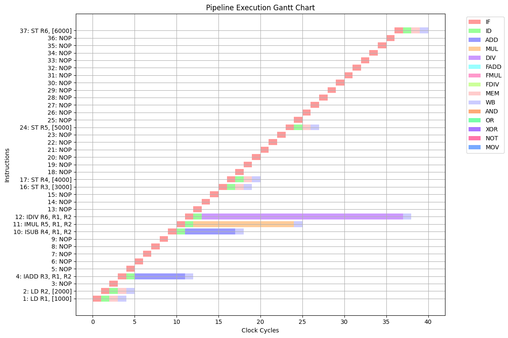

# VLIW Processor Simulation

## Introduction

The VLIW (Very Long Instruction Word) processor is a type of processor architecture that allows the parallel execution of multiple instructions in a single cycle. VLIW processors achieve this by encoding several operations within a single instruction word, which can be executed simultaneously by various functional units. Unlike traditional processors that rely on complex dynamic scheduling, VLIW processors depend on the compiler to determine parallelism at compile-time.

This simulation aims to model a VLIW processor with multiple functional units for integer, floating-point, and memory operations, implementing instruction scheduling, hazard handling, and clock cycle execution.

## Processor Functional Units

The processor contains several functional units, each with its own latency for executing specific instructions. Below are the different types of functional units available:

1. **Integer Operations**:
   - Integer Addition/Subtraction (IADD, ISUB): 6 cycles
   - Integer Multiplication (IMUL): 12 cycles

2. **Floating-Point Operations**:
   - Floating-Point Addition/Subtraction (FADD, FSUB): 18 cycles
   - Floating-Point Multiplication (FMUL): 30 cycles

3. **Memory Operations**:
   - Load (LD): 1 cycle
   - Store (ST): 1 cycle

4. **Logic Operations**:
   - AND, OR, XOR: 1 cycle

5. **No-Operation (NOP)**:
   - A special instruction used to introduce delays to resolve hazards.

## Instruction Hazards

In VLIW processors, hazards can occur when there are dependencies between instructions, preventing them from being executed simultaneously. These hazards are categorized into three types:

### 1. Structural Hazards
Structural hazards occur when two or more instructions require the same functional unit at the same time. Since the processor has limited functional units, only one instruction can use each unit at a time. To handle structural hazards, **NOPs (No Operation)** are inserted to delay the execution of conflicting instructions.

### 2. Data Hazards
Data hazards arise from dependencies between instructions that share registers as operands or results. There are three types of data hazards:

#### a. **Read-After-Write (RAW) Hazard (True Dependency)**
RAW hazards occur when an instruction depends on the result of a previous instruction. For example, if one instruction writes to a register, and another instruction reads the same register before the write is completed, a RAW hazard occurs.

#### b. **Write-After-Write (WAW) Hazard (Anti-Dependency)**
WAW hazards occur when two instructions write to the same register. If the second instruction writes to the register before the first one, the result will be incorrect.

#### c. **Write-After-Read (WAR) Hazard (Output Dependency)**
WAR hazards occur when an instruction writes to a register that is being read by a previous instruction. This can lead to incorrect values being read if the write operation happens before the read operation.

### Hazard Resolution
- **For Structural Hazards**, the code inserts NOPs to ensure that conflicting instructions do not execute in parallel.
- **For Data Hazards (RAW, WAW, WAR)**, NOPs are inserted to resolve read-after-write and write-after-read dependencies, ensuring the instructions execute in the correct order.

## Code Explanation

The provided Python code simulates a VLIW processor. Below is a detailed explanation of the code:

### 1. **Pipeline Stages and Latency**
Each instruction type is associated with specific pipeline stages and latencies. These stages include:
   - IF (Instruction Fetch)
   - ID (Instruction Decode)
   - Execution stage (e.g., ADD, MUL, FADD, etc.)
   - WB (Write-back)

For example, the integer addition (`IADD`) takes 6 cycles in the execution stage (`ADD`), and the floating-point multiplication (`FMUL`) takes 30 cycles in the execution stage (`FMUL`).

### 2. **Instruction Parsing**
The code parses assembly code, extracting the operation type, destination register, and source registers using regular expressions (regex). It then creates a list of instruction objects, each containing:
   - `op`: Operation type (e.g., IADD, LD, ST, etc.)
   - `dest`: Destination register
   - `src1`, `src2`: Source registers
   - `stages`: Pipeline stages with their corresponding latencies

### 3. **Hazard Detection and Resolution**
   - **Structural Hazards**: The function `insert_nops_for_structural_hazards` identifies conflicts between functional units and inserts NOPs to resolve these conflicts.
   - **Data Hazards**: The function `handle_data_dependencies` checks for RAW, WAW, and WAR hazards by comparing registers involved in the instructions. If a hazard is detected, NOPs are inserted to resolve the dependency and ensure correct execution order.

### 4. **Clock Cycle Simulation**
The function `display_clock_cycle_execution` simulates the clock cycle execution of instructions. It displays the instruction timeline, indicating which stage each instruction is in during each cycle. This allows the user to visualize the entire execution process and identify potential hazards.

### 5. **Main Simulation Logic**
The main function:
   - Parses the assembly code into instructions.
   - Resolves structural hazards by inserting NOPs.
   - Handles data dependencies (RAW, WAW, WAR) by inserting NOPs where necessary.
   - Prints the updated instruction list with inserted NOPs.
   - Displays the total number of clock cycles taken by the program and the execution timeline.

### Example Input:
```plaintext
# calculator program
LD R1, [1000]
LD R2, [2000]
IADD R3, R1, R2
ISUB R4, R1, R2
IMUL R5, R1, R2
IDIV R6, R1, R2
ST R3, [3000]
ST R4, [4000]
ST R5, [5000]
ST R6, [6000]
```

### Example Output:
```plaintext
Updated Code with NOPs:
LD R1, [1000]
LD R2, [2000]
NOP
IADD R3, R1, R2
NOP
NOP
NOP
NOP
NOP
ISUB R4, R1, R2
IMUL R5, R1, R2
IDIV R6, R1, R2
NOP
NOP
NOP
ST R3, [3000]
ST R4, [4000]
NOP
NOP
NOP
NOP
NOP
NOP
ST R5, [5000]
NOP
NOP
NOP
NOP
NOP
NOP
NOP
NOP
NOP
NOP
NOP
NOP
ST R6, [6000]

Total clock cycles: 40
 
 
Functional Units Execution:
   |       ADD       |       MUL       |       DIV       |   FADD   |   FMUL   |   FDIV   |    AND     | OR  |    XOR     |    NOT     |      MEM      |
 1 |                 |                 |                 |          |          |          |            |     |            |            | LD R1, [1000] |
 2 |                 |                 |                 |          |          |          |            |     |            |            | LD R2, [2000] |
 3 |       NOP       |       NOP       |       NOP       |   NOP    |   NOP    |   NOP    |    NOP     | NOP |    NOP     |    NOP     |      NOP      |
 4 | IADD R3, R1, R2 |                 |                 |          |          |          |            |     |            |            |               |
 5 |       NOP       |       NOP       |       NOP       |   NOP    |   NOP    |   NOP    |    NOP     | NOP |    NOP     |    NOP     |      NOP      |
 6 |       NOP       |       NOP       |       NOP       |   NOP    |   NOP    |   NOP    |    NOP     | NOP |    NOP     |    NOP     |      NOP      |
 7 |       NOP       |       NOP       |       NOP       |   NOP    |   NOP    |   NOP    |    NOP     | NOP |    NOP     |    NOP     |      NOP      |
 8 |       NOP       |       NOP       |       NOP       |   NOP    |   NOP    |   NOP    |    NOP     | NOP |    NOP     |    NOP     |      NOP      |
 9 |       NOP       |       NOP       |       NOP       |   NOP    |   NOP    |   NOP    |    NOP     | NOP |    NOP     |    NOP     |      NOP      |
10 | ISUB R4, R1, R2 |                 |                 |          |          |          |            |     |            |            |               |
11 |                 | IMUL R5, R1, R2 |                 |          |          |          |            |     |            |            |               |
12 |                 |                 | IDIV R6, R1, R2 |          |          |          |            |     |            |            |               |
13 |       NOP       |       NOP       |       NOP       |   NOP    |   NOP    |   NOP    |    NOP     | NOP |    NOP     |    NOP     |      NOP      |
14 |       NOP       |       NOP       |       NOP       |   NOP    |   NOP    |   NOP    |    NOP     | NOP |    NOP     |    NOP     |      NOP      |
15 |       NOP       |       NOP       |       NOP       |   NOP    |   NOP    |   NOP    |    NOP     | NOP |    NOP     |    NOP     |      NOP      |
16 |                 |                 |                 |          |          |          |            |     |            |            | ST R3, [3000] |
17 |                 |                 |                 |          |          |          |            |     |            |            | ST R4, [4000] |
18 |       NOP       |       NOP       |       NOP       |   NOP    |   NOP    |   NOP    |    NOP     | NOP |    NOP     |    NOP     |      NOP      |
19 |       NOP       |       NOP       |       NOP       |   NOP    |   NOP    |   NOP    |    NOP     | NOP |    NOP     |    NOP     |      NOP      |
20 |       NOP       |       NOP       |       NOP       |   NOP    |   NOP    |   NOP    |    NOP     | NOP |    NOP     |    NOP     |      NOP      |
21 |       NOP       |       NOP       |       NOP       |   NOP    |   NOP    |   NOP    |    NOP     | NOP |    NOP     |    NOP     |      NOP      |
22 |       NOP       |       NOP       |       NOP       |   NOP    |   NOP    |   NOP    |    NOP     | NOP |    NOP     |    NOP     |      NOP      |
23 |       NOP       |       NOP       |       NOP       |   NOP    |   NOP    |   NOP    |    NOP     | NOP |    NOP     |    NOP     |      NOP      |
24 |                 |                 |                 |          |          |          |            |     |            |            | ST R5, [5000] |
25 |       NOP       |       NOP       |       NOP       |   NOP    |   NOP    |   NOP    |    NOP     | NOP |    NOP     |    NOP     |      NOP      |
26 |       NOP       |       NOP       |       NOP       |   NOP    |   NOP    |   NOP    |    NOP     | NOP |    NOP     |    NOP     |      NOP      |
27 |       NOP       |       NOP       |       NOP       |   NOP    |   NOP    |   NOP    |    NOP     | NOP |    NOP     |    NOP     |      NOP      |
28 |       NOP       |       NOP       |       NOP       |   NOP    |   NOP    |   NOP    |    NOP     | NOP |    NOP     |    NOP     |      NOP      |
29 |       NOP       |       NOP       |       NOP       |   NOP    |   NOP    |   NOP    |    NOP     | NOP |    NOP     |    NOP     |      NOP      |
30 |       NOP       |       NOP       |       NOP       |   NOP    |   NOP    |   NOP    |    NOP     | NOP |    NOP     |    NOP     |      NOP      |
31 |       NOP       |       NOP       |       NOP       |   NOP    |   NOP    |   NOP    |    NOP     | NOP |    NOP     |    NOP     |      NOP      |
32 |       NOP       |       NOP       |       NOP       |   NOP    |   NOP    |   NOP    |    NOP     | NOP |    NOP     |    NOP     |      NOP      |
33 |       NOP       |       NOP       |       NOP       |   NOP    |   NOP    |   NOP    |    NOP     | NOP |    NOP     |    NOP     |      NOP      |
34 |       NOP       |       NOP       |       NOP       |   NOP    |   NOP    |   NOP    |    NOP     | NOP |    NOP     |    NOP     |      NOP      |
35 |       NOP       |       NOP       |       NOP       |   NOP    |   NOP    |   NOP    |    NOP     | NOP |    NOP     |    NOP     |      NOP      |
36 |       NOP       |       NOP       |       NOP       |   NOP    |   NOP    |   NOP    |    NOP     | NOP |    NOP     |    NOP     |      NOP      |
37 |                 |                 |                 |          |          |          |            |     |            |            | ST R6, [6000] |
 
 
Clock Cycle Execution:
                     |   1   |   2   |   3   |   4   |   5   |   6   |   7   |   8   |   9   |  10   |  11   |  12   |  13   |  14   |  15   |  16   |  17   |  18   |  19   |  20   |  21   |  22   |  23   |  24   |  25   |  26   |  27   |  28   |  29   |  30   |  31   |  32   |  33   |  34   |  35   |  36   |  37   |  38   |  39   |  40   |
1: LD R1, [1000]    |  IF   |  ID   |  MEM  |  WB   |       |       |       |       |       |       |       |       |       |       |       |       |       |       |       |       |       |       |       |       |       |       |       |       |       |       |       |       |       |       |       |       |       |       |       |       |
2: LD R2, [2000]    |       |  IF   |  ID   |  MEM  |  WB   |       |       |       |       |       |       |       |       |       |       |       |       |       |       |       |       |       |       |       |       |       |       |       |       |       |       |       |       |       |       |       |       |       |       |       |
3: NOP              |       |       |  IF   |       |       |       |       |       |       |       |       |       |       |       |       |       |       |       |       |       |       |       |       |       |       |       |       |       |       |       |       |       |       |       |       |       |       |       |       |       |
4: IADD R3, R1, R2  |       |       |       |  IF   |  ID   |  ADD  |  ADD  |  ADD  |  ADD  |  ADD  |  ADD  |  WB   |       |       |       |       |       |       |       |       |       |       |       |       |       |       |       |       |       |       |       |       |       |       |       |       |       |       |       |       |
5: NOP              |       |       |       |       |  IF   |       |       |       |       |       |       |       |       |       |       |       |       |       |       |       |       |       |       |       |       |       |       |       |       |       |       |       |       |       |       |       |       |       |       |       |
6: NOP              |       |       |       |       |       |  IF   |       |       |       |       |       |       |       |       |       |       |       |       |       |       |       |       |       |       |       |       |       |       |       |       |       |       |       |       |       |       |       |       |       |       |
7: NOP              |       |       |       |       |       |       |  IF   |       |       |       |       |       |       |       |       |       |       |       |       |       |       |       |       |       |       |       |       |       |       |       |       |       |       |       |       |       |       |       |       |       |
8: NOP              |       |       |       |       |       |       |       |  IF   |       |       |       |       |       |       |       |       |       |       |       |       |       |       |       |       |       |       |       |       |       |       |       |       |       |       |       |       |       |       |       |       |
9: NOP              |       |       |       |       |       |       |       |       |  IF   |       |       |       |       |       |       |       |       |       |       |       |       |       |       |       |       |       |       |       |       |       |       |       |       |       |       |       |       |       |       |       |
10: ISUB R4, R1, R2 |       |       |       |       |       |       |       |       |       |  IF   |  ID   |  ADD  |  ADD  |  ADD  |  ADD  |  ADD  |  ADD  |  WB   |       |       |       |       |       |       |       |       |       |       |       |       |       |       |       |       |       |       |       |       |       |       |
11: IMUL R5, R1, R2 |       |       |       |       |       |       |       |       |       |       |  IF   |  ID   |  MUL  |  MUL  |  MUL  |  MUL  |  MUL  |  MUL  |  MUL  |  MUL  |  MUL  |  MUL  |  MUL  |  MUL  |  WB   |       |       |       |       |       |       |       |       |       |       |       |       |       |       |       |
12: IDIV R6, R1, R2 |       |       |       |       |       |       |       |       |       |       |       |  IF   |  ID   |  DIV  |  DIV  |  DIV  |  DIV  |  DIV  |  DIV  |  DIV  |  DIV  |  DIV  |  DIV  |  DIV  |  DIV  |  DIV  |  DIV  |  DIV  |  DIV  |  DIV  |  DIV  |  DIV  |  DIV  |  DIV  |  DIV  |  DIV  |  DIV  |  WB   |       |       |
13: NOP             |       |       |       |       |       |       |       |       |       |       |       |       |  IF   |       |       |       |       |       |       |       |       |       |       |       |       |       |       |       |       |       |       |       |       |       |       |       |       |       |       |       |
14: NOP             |       |       |       |       |       |       |       |       |       |       |       |       |       |  IF   |       |       |       |       |       |       |       |       |       |       |       |       |       |       |       |       |       |       |       |       |       |       |       |       |       |       |
15: NOP             |       |       |       |       |       |       |       |       |       |       |       |       |       |       |  IF   |       |       |       |       |       |       |       |       |       |       |       |       |       |       |       |       |       |       |       |       |       |       |       |       |       |
16: ST R3, [3000]   |       |       |       |       |       |       |       |       |       |       |       |       |       |       |       |  IF   |  ID   |  MEM  |  WB   |       |       |       |       |       |       |       |       |       |       |       |       |       |       |       |       |       |       |       |       |       |
17: ST R4, [4000]   |       |       |       |       |       |       |       |       |       |       |       |       |       |       |       |       |  IF   |  ID   |  MEM  |  WB   |       |       |       |       |       |       |       |       |       |       |       |       |       |       |       |       |       |       |       |       |
18: NOP             |       |       |       |       |       |       |       |       |       |       |       |       |       |       |       |       |       |  IF   |       |       |       |       |       |       |       |       |       |       |       |       |       |       |       |       |       |       |       |       |       |       |
19: NOP             |       |       |       |       |       |       |       |       |       |       |       |       |       |       |       |       |       |       |  IF   |       |       |       |       |       |       |       |       |       |       |       |       |       |       |       |       |       |       |       |       |       |
20: NOP             |       |       |       |       |       |       |       |       |       |       |       |       |       |       |       |       |       |       |       |  IF   |       |       |       |       |       |       |       |       |       |       |       |       |       |       |       |       |       |       |       |       |
21: NOP             |       |       |       |       |       |       |       |       |       |       |       |       |       |       |       |       |       |       |       |       |  IF   |       |       |       |       |       |       |       |       |       |       |       |       |       |       |       |       |       |       |       |
22: NOP             |       |       |       |       |       |       |       |       |       |       |       |       |       |       |       |       |       |       |       |       |       |  IF   |       |       |       |       |       |       |       |       |       |       |       |       |       |       |       |       |       |       |
23: NOP             |       |       |       |       |       |       |       |       |       |       |       |       |       |       |       |       |       |       |       |       |       |       |  IF   |       |       |       |       |       |       |       |       |       |       |       |       |       |       |       |       |       |
24: ST R5, [5000]   |       |       |       |       |       |       |       |       |       |       |       |       |       |       |       |       |       |       |       |       |       |       |       |  IF   |  ID   |  MEM  |  WB   |       |       |       |       |       |       |       |       |       |       |       |       |       |
25: NOP             |       |       |       |       |       |       |       |       |       |       |       |       |       |       |       |       |       |       |       |       |       |       |       |       |  IF   |       |       |       |       |       |       |       |       |       |       |       |       |       |       |       |
26: NOP             |       |       |       |       |       |       |       |       |       |       |       |       |       |       |       |       |       |       |       |       |       |       |       |       |       |  IF   |       |       |       |       |       |       |       |       |       |       |       |       |       |       |
27: NOP             |       |       |       |       |       |       |       |       |       |       |       |       |       |       |       |       |       |       |       |       |       |       |       |       |       |       |  IF   |       |       |       |       |       |       |       |       |       |       |       |       |       |
28: NOP             |       |       |       |       |       |       |       |       |       |       |       |       |       |       |       |       |       |       |       |       |       |       |       |       |       |       |       |  IF   |       |       |       |       |       |       |       |       |       |       |       |       |
29: NOP             |       |       |       |       |       |       |       |       |       |       |       |       |       |       |       |       |       |       |       |       |       |       |       |       |       |       |       |       |  IF   |       |       |       |       |       |       |       |       |       |       |       |
30: NOP             |       |       |       |       |       |       |       |       |       |       |       |       |       |       |       |       |       |       |       |       |       |       |       |       |       |       |       |       |       |  IF   |       |       |       |       |       |       |       |       |       |       |
31: NOP             |       |       |       |       |       |       |       |       |       |       |       |       |       |       |       |       |       |       |       |       |       |       |       |       |       |       |       |       |       |       |  IF   |       |       |       |       |       |       |       |       |       |
32: NOP             |       |       |       |       |       |       |       |       |       |       |       |       |       |       |       |       |       |       |       |       |       |       |       |       |       |       |       |       |       |       |       |  IF   |       |       |       |       |       |       |       |       |
33: NOP             |       |       |       |       |       |       |       |       |       |       |       |       |       |       |       |       |       |       |       |       |       |       |       |       |       |       |       |       |       |       |       |       |  IF   |       |       |       |       |       |       |       |
34: NOP             |       |       |       |       |       |       |       |       |       |       |       |       |       |       |       |       |       |       |       |       |       |       |       |       |       |       |       |       |       |       |       |       |       |  IF   |       |       |       |       |       |       |
35: NOP             |       |       |       |       |       |       |       |       |       |       |       |       |       |       |       |       |       |       |       |       |       |       |       |       |       |       |       |       |       |       |       |       |       |       |  IF   |       |       |       |       |       |
36: NOP             |       |       |       |       |       |       |       |       |       |       |       |       |       |       |       |       |       |       |       |       |       |       |       |       |       |       |       |       |       |       |       |       |       |       |       |  IF   |       |       |       |       |
37: ST R6, [6000]   |       |       |       |       |       |       |       |       |       |       |       |       |       |       |       |       |       |       |       |       |       |       |       |       |       |       |       |       |       |       |       |       |       |       |       |       |  IF   |  ID   |  MEM  |  WB   |
```

